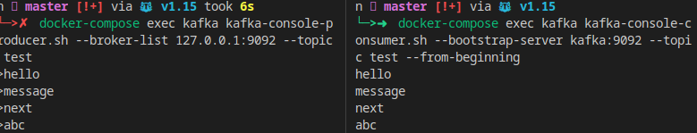
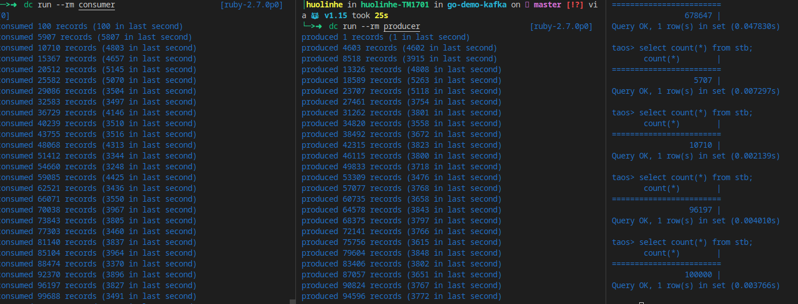

# TDengine Demo Series - Consume Messages from Kafka

## A Simple Start

### Kafka Setup

```sh
docker-compose up -d kafka
```

### Create Topic

```sh
docker-compose exec kafka \
  kafka-topics.sh --create \
    --zookeeper zookeeper:2181 \
    --replication-factor 1 \
    --partitions 10 \
    --topic test
# check topic list
docker-compose exec kafka \
  kafka-topics.sh --list \
  --zookeeper zookeeper:2181
```

### Producer and Consumer Test using internal client

```sh
docker-compose exec kafka \
  kafka-console-producer.sh --broker-list kafka:9092 --topic test
docker-compose exec kafka \
  kafka-console-consumer.sh --bootstrap-server kafka:9092 --topic test --from-beginning
```

Alter partitions

```sh
docker-compose exec kafka \
  kafka-topics.sh --bootstrap-server kafka:9092 --alter --topic test --partitions 10
```



### Go Producer and Consumer

*NOTE: may only works on ubuntu because of the runtime image.*

First we start tdengine in docker-compose

```sh
docker-compose up -d tdengine
```

Create test database

```sh
docker-compose exec tdengine taos -s "create database if not exists test"
```

Build go producer and consumer.

```sh
go build cmd/producer/producer.go 
go build cmd/consumer/consumer.go
```

Run consumer.

```sh
docker-compose run --rm consumer
```

Run producer.

```sh
docker-compose run --rm producer
```

The results in console:



To use multiple consumer, it only requires your topic and messages support multitple paritions. When it's ready, just start multiple consumer service, use docker-compose, it will be:

```sh
$ docker-compose up -d --scale consumer=2 consumer
Creating go-demo-kafka_consumer_1 ... done
Creating go-demo-kafka_consumer_2 ... done
```

The consumers will consume different partitions automatically.

## Design Goals

- Produce messages from kafka, and consume them to TDengine
- Works as multi-producer-multi-consumer mode
- Avoid redundant consuming
- Insert into TDengine batch by batch
- Modular development
- Easy to config
- Easy to use as an project template

## Code Details

*We use <https://github.com/golang-standards/project-layout> for modular development. Make your decision as you prefer.*

We have developed some reusable modules for the use case:

- [Queue](pkg/queue): A batch queue could handle message in batch.
- [TaosEncoder](pkg/utils/tosql.go): Inteface and helpers for build sql easily.
- [Codec](pkg/utils/codec.go): Interface and helpers for message encoding/decoding.
- [MQ](pkg/kafka/common/common.go): Abstraction for message queue, eg. kafka.
- [MQ - Kafka](pkg/kafka/kafka/): Kafka implementations of MQ.

For demo use case, we have implemented an demo message object and Codec/TaosEncoder interfaces in [internal/record](internal/record.go). Implement as you need for real use.

A message simulator is implemented in [internal/config.go](internal/config.go).

Then, producer and consumer commands are avalible at [cmd/](cmd/) directory:

- producer: [cmd/producer/producer.go](cmd/producer/producer.go)
- consumer: [cmd/consumer/consumer.go](cmd/consumer/consumer.go)

### Demo Message Details

Demo message object:

```go
// Record is the structual message object detail, provide both Codec and TaosEncoder interface.
type Record struct {
	DeviceID  string // for table name
	Timestamp time.Time
	Cols      []interface{}
}
```

TaosEncoder interface

```go
type TaosEncoder interface {
	TaosDatabase() string
	TaosSTable() string
	TaosTable() string
	TaosTags() []interface{}
	TaosCols() []string
	TaosValues() []interface{}
}
```

The implementation, check comments for each method for the definition.

```go
// TaosEncoder implementations

// If this is setted, sql will use db.table for tablename
func (r Record) TaosDatabase() string {
	return ""
}

// Auto create table using stable and tags
func (r Record) TaosSTable() string {
	return "stb"
}

// tags must be setted with TaosSTable
func (r Record) TaosTags() []interface{} {
	var tags []interface{}
	tags = append(tags, r.DeviceID)
	return tags
}

// Dynamic device id as table name
func (r Record) TaosTable() string {
	return r.DeviceID
}

// Use specific column names as you need
func (r Record) TaosCols() []string {
	var tags []string
	return tags
}

// Values
func (r Record) TaosValues() []interface{} {
	var values []interface{}
	values = append(values, r.Timestamp)
	values = append(values, r.Cols...)
	return values
}
```

Consumer will use `ToTaosBatchInsertSql` method in [pkg/utils](pkg/utils/) package to generate sql in batch. You can see more details in [pkg/utils/tosql.go](pkg/utils/tosql.go).

`Codec` implementations, `Partition` id is provided in this interface.

```go
// Interface for message
type Codec interface {
	CodecMethod() CodecMethodEnum
	Partition() int32
}

// Change max partitions as you need.
const MAX_PARTITIONS = 10

// Codec interface

// Encoding method
func (r Record) CodecMethod() utils.CodecMethodEnum {
	return utils.MessagePack
}

// Show how to set partition for an message
func (r Record) Partition() int32 {
	h := fnv.New32a()
	h.Write([]byte(r.DeviceID))
	return int32(h.Sum32() % MAX_PARTITIONS)
}
```

### Demo Consumer Details

We'll use all the above to build an feature-rich consumer.

- Everything is configurable.
- Stateless: zero-config for scaling.
- Clear code.
- Multithreading.
- Gracefully teminating.

Here is the implementation.

#### 1. List all options

```go
var kafkaOptions options.Kafka
var topic string = "test"
var consumedRecords int64
var log = logrus.New()
var qOption *queue.Option = queue.DefaultOption().SetMaxQueueSize(10000).SetMaxBatchSize(100)
var q *queue.Queue
var workers = 4
var taosuri = "root:taosdata/tcp(tdengine:6030)/test"
var consumedPartions = make([]int, record.MAX_PARTITIONS)
```

Config with flag:

```go
// Option parsing
qOption.FlagInit()
kafkaOptions.Init()
flag.StringVar(&topic, "topic", topic, "kafka topic to consume")
flag.StringVar(&taosuri, "taosuri", topic, "TDengine uri")
flag.IntVar(&workers, "worker", workers, "worker for TDengine insertion")
flag.Parse()
```

#### 2. Setup batch queue

```go
q = queue.NewWithOption(qOption)
```

#### 3. Prepare logger

```go
// var log = logrus.New()
logger := log.WithFields(logrus.Fields{
  "topic": topic,
})
```

#### 4. Subscribe kafka with topic

Some event handler:

```go
// OnConnect hanlder
func onConnect() {
	log.Println("connected")
}

// OnConnectionLost handler
func onConnectionLost(err error) {
	log.Println("connection lost")
}
// Consume message and push to batch queue
func msgHandler(message *sarama.ConsumerMessage) (err error) {
	var r record.Record
	// for partition messages count in each consumer, you can ignore it
	consumedPartions[message.Partition] += 1
	err = utils.FromKafkaBytes(message.Value, &r)
	if err != nil {
		log.Errorf("Partition:%d Offset:%d Key:%v Err: %v\n", message.Partition, message.Offset, message.Key, err)
		return err
	}
	_, err = q.Enqueue(r)
	return err
}
```

Subscribe in main:

```go
// Subscribe kafka
mq := kafka.Run(&kafkaOptions, logger, common.Options{OnConnect: onConnect, OnConnectionLost: onConnectionLost})
handler, err := mq.QueueSubscribe(topic, topic, msgHandler)
if err != nil {
  log.Error("subscribe error: ", err)
  os.Exit(1)
}
```

#### 5. Consume messages batch by batch with multithread workers.

Here, we implment an function called `TaosConsume`:

```go
// Parallel insert use goroutines
func TaosConsume(q *queue.Queue, taos *sql.DB, workers int) {
	// Setup workers for batch queue
	for i := 0; i < workers; i++ {
		go func(q *queue.Queue) {
			for {
				runtime.Gosched()
				records, err := q.Dequeue()
				if err != nil {
					time.Sleep(200 * time.Millisecond)
					continue
				}
				sql, err := utils.ToTaosBatchInsertSql(records)
				if err != nil {
					log.Errorf("cannot build sql with records: %v", err)
					continue
				}
				runtime.Gosched()
				// fmt.Println(sql)
				res, err := taos.Exec(sql)
				if err != nil {
					log.Errorf("exec query error: %v, the sql command is:\n%s\n", err, sql)
				}

				runtime.Gosched()
				n, _ := res.RowsAffected()
				atomic.AddInt64(&consumedRecords, n)
			}
		}(q)
	}
	// Setup a watcher goroutine for profiling
	go func() {
		var last int64
		for {
			consumed := atomic.LoadInt64(&consumedRecords)
			if consumed == 0 {
				continue
			}
			time.Sleep(1 * time.Second)
			if consumed-last != 0 {
				log.Infof("consumed %d records (%d in last second), consumed partitions:%v\n",
					consumed, consumed-last, consumedPartions)
			}
			last = consumed
		}

	}()
}
```

Call this func in main:

```go
// Consume message object queue to TDengine batch by batch
ToasConsume(q, taos, workers)
```

#### 6. Listen to the os signals to hold

```go
c := make(chan os.Signal, 2)
signal.Notify(c, os.Interrupt, syscall.SIGTERM)
<-c
```

#### 7. Gracefully teminated

```go
// 1. stop the queue to not recived data any more
q.Pause()
// 2. stop subscribe handler
handler.Unsubscribe()
// 3. wait until all consumed messages and their jobs are finished
for {
	if q.IsEmpty() {
		log.Info("all job in the queue is finished")
		break
	}
	time.Sleep(100 * time.Millisecond)
}
// 4. stop the message queue
mq.Stop()
```
